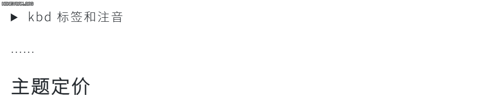

# 短代码

**短代码**可以直接在文章编辑器里书写，可以与 Markdown 标识混用，用来帮助写作者更好地排版。

### Tip（提示框）

Tip 用来展示一段需要被读者注意的简短**提示/警告信息**，有多种颜色供选择，语法如下：

```text
[tip]普通的灰色 Tip[/tip]
[tip type="blue"]蓝色的 Tip，通常用于标识一段有用的信息[/tip]
[tip type="yellow"]黄色的 Tip，通常用于标识一段需要引起注意的信息[/tip]
[tip type="red"]红色的 Tip，通常用于标识一段警告信息[/tip]
[tip type="green"]绿色的 Tip，通常用于标识一段祝贺/成功/正面的信息[/tip]
[tip type="purple"]紫色的 Tip，无实义[/tip]
```


你还可以用 Tip Group 把这些 Tip 放在一起，这会让他们排列得更紧密

```text
[tip-group]
[tip]普通的灰色 Tip[/tip]
[tip type="blue"]蓝色的 Tip，通常用于标识一段有用的信息[/tip]
[tip type="yellow"]黄色的 Tip，通常用于标识一段需要引起注意的信息[/tip]
[tip type="red"]红色的 Tip，通常用于标识一段警告信息[/tip]
[tip type="green"]绿色的 Tip，通常用于标识一段祝贺/成功/正面的信息[/tip]
[tip type="purple"]紫色的 Tip，无实义[/tip]
[/tip-group]
```


### Shadow（阴影工具）

使用阴影工具，可以给图片和表格添加阴影效果，使内容更突出

```text
[shadow][/shadow]

[shadow]
| 表头 | 表头 | 表头 | 表头 |
| --- | --- | --- | --- |
| 表项 | 表项 | 表项 | 表项 |
[/shadow]

<!-- 或者 -->

[shadow]


| 表头 | 表头 | 表头 | 表头 |
| --- | --- | --- | --- |
| 表项 | 表项 | 表项 | 表项 |
[/shadow]
```


### 键盘按键和注音

用 `[[]]` 创建一个用于表示键盘按键的行内元素，例如：

```text
[[Ctrl]] [[Del]] [[+]]
```


用 `{{:}}` 为一段文字标注读音，例如：

```text
蚊子的幼虫叫{{孑孓:jie jue}}
```


### Details（折叠框）

使用以下语法构造一个折叠框，可以将一些内容折叠起来，访客点击标题才能看到内容。

```text
[details sum="标题"]
折叠内容
[/details]
```


折叠框采用 html 原生的 `<details>` 标签，并使用 js 垫片优化了其兼容性，面向未来，向下兼容。





